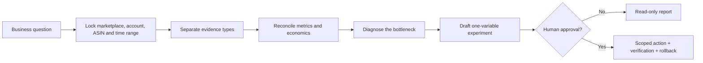

<div align="center">
  
  <h1>SeaLeap Amazon Ads Skills</h1>
  <p><strong>Give your AI agent an evidence-first Amazon Ads operating brain.</strong></p>
  <p>让 Agent 不只会“给建议”，而是会诊断、会算账、会留证据、会等待人工批准。</p>

  <p>
    <a href="https://github.com/xjli360/sealeap-amazon-ad-skills/stargazers"></a>
    
    
    
  </p>

  <p>
    <a href="#-skill-map">Explore the Skills</a> ·
    <a href="#-quick-start">Quick Start</a> ·
    <a href="#-how-the-skills-think">How It Works</a> ·
    <a href="#-star--contribute">Star & Contribute</a>
  </p>
</div>

---

## Why this repository

Most AI advice for Amazon Ads sounds confident but cannot show its work. This collection is built for a different standard:

- **Operational, not generic** — each Skill has a concrete workflow, input expectations, output contract, and decision gates.
- **Evidence-aware** — account facts, current platform policy, training cases, and hypotheses stay explicitly separated.
- **Profit-aware** — ACOS is connected to CPC, CVR, contribution margin, inventory, returns, and lifecycle goals.
- **Agent-ready** — every top-level directory is a self-contained Skill with a standard `SKILL.md` entrypoint.
- **Human-controlled** — diagnosis and drafts are the default; live changes require explicit, itemized approval.

> **One rule runs through every Skill:** never turn a course example, benchmark, or AI guess into a live campaign setting without current account evidence.

## 🧭 Skill map

| Skill | What it helps an agent do | Best for |
|---|---|---|
| [ACOS Diagnostics](sealeap-amazon-acos-diagnostics/) | Reconcile ACOS, ROAS, TACOS, CTR, CPC, CVR, AOV, placement, attribution, and profit signals; produce one attributable experiment | High ACOS, wasted spend, weak conversion, unclear break-even point |
| [Ad Architecture](sealeap-amazon-ad-architecture/) | Work backward from sales and profit goals into campaign roles, keyword priorities, budgets, and stage plans | Launch architecture, portfolio design, red-ocean categories, seasonal planning |
| [US Apparel Lifecycle Ads](sealeap-amazon-apparel-lifecycle-ads/) | Diagnose long-, short-, and seasonal-lifecycle apparel products with US-specific playbooks | Fashion, underwear, swimwear, suits, accessories, lifecycle transitions |
| [Canada Apparel Ads](sealeap-amazon-ca-apparel-ads/) | Combine lifecycle, seasonality, English/French discovery, margin, and inventory guardrails | Amazon.ca apparel, coats, undergarments, bilingual demand |
| [EU AMC Audiences](sealeap-amazon-eu-amc-audience/) | Plan privacy-safe AMC analysis, journey measurement, audience creation, activation, and evaluation | European AMC, path analysis, reach/frequency, new-to-brand, remarketing |
| [Japan Apparel Ads](sealeap-amazon-jp-apparel-ads/) | Apply Japan-specific consumer, language, seasonality, Points, and lifecycle evidence | Amazon.co.jp apparel, bags, underwear, swimwear, localized launches |
| [Listing Optimizer](sealeap-amazon-listing-optimizer/) | Audit and draft titles, bullets, attributes, search terms, image briefs, A+, video, and controlled tests | CTR/CVR gaps, indexing, return prevention, ad-to-listing relevance |
| [Product Targeting](sealeap-amazon-product-targeting/) | Build ASIN/category targeting pools for competitor, substitute, complement, cross-sell, upsell, and defense use cases | Product targeting, category targeting, detail-page traffic, ASIN defense |
| [UK Apparel Ads](sealeap-amazon-uk-apparel-ads/) | Combine UK lifecycle, seasonality, sizing, returns, compliance gates, and advertising economics | Amazon.co.uk apparel, Black Friday, Boxing Day, swimwear, outerwear |

## ⚡ Quick start

Clone the collection:

```bash
git clone https://github.com/xjli360/sealeap-amazon-ad-skills.git
cd sealeap-amazon-ad-skills
```

Choose the Skill that matches the job, then point your agent to its `SKILL.md` file or copy that directory into the Skills directory supported by your agent runtime.

Example prompt:

```text
Use sealeap-amazon-acos-diagnostics in DIAGNOSE mode.

Marketplace: US
Date range: last 30 days
Goal: determine whether the ACOS problem is driven by CPC, CVR,
traffic mix, attribution, or unit economics.

Do not change campaigns. Show missing evidence and propose exactly
one single-variable experiment for human review.
```

Each Skill tells the agent which reference files to load, what data is still missing, which claims are safe to make, and where human approval is mandatory.

## 🧠 How the Skills think



The shared evidence language keeps an agent honest:

| Label | Meaning |
|---|---|
| `ACCOUNT_FACT` / `ACCOUNT_ACTUAL` | Verified data from the current authorized account and scope |
| `CURRENT_POLICY` | A current platform rule checked against an authoritative source |
| `TRAINING_CASE` / `COURSE_BASELINE` | A teaching example or historical benchmark, never a live setting by itself |
| `HYPOTHESIS` / `SELLER_HYPOTHESIS` | A testable explanation that still needs evidence |
| `NEEDS_DATA` / `HOLD` | A hard stop: the agent must not invent the missing fact |

## 🛡️ Built-in operating guardrails

- Read-only diagnosis is the default mode.
- Marketplace, profile, seller, store, ASIN, SKU, currency, attribution window, and date range must stay explicit.
- Campaign writes require current scope verification and itemized human approval.
- Every change plan includes evidence, expected effect, stop condition, and rollback value.
- One experiment changes one primary variable so the result remains attributable.
- Listing claims must be backed by verified product facts; competitor copy and invented claims are out of bounds.
- AMC workflows stay aggregated and privacy-safe; no user-level export or re-identification.

## 📦 Repository structure

```text
sealeap-amazon-ad-skills/
├── sealeap-amazon-acos-diagnostics/
├── sealeap-amazon-ad-architecture/
├── sealeap-amazon-apparel-lifecycle-ads/
├── sealeap-amazon-ca-apparel-ads/
├── sealeap-amazon-eu-amc-audience/
├── sealeap-amazon-jp-apparel-ads/
├── sealeap-amazon-listing-optimizer/
├── sealeap-amazon-product-targeting/
└── sealeap-amazon-uk-apparel-ads/
```

A Skill may include:

```text
SKILL.md              # Agent entrypoint and operating workflow
agents/openai.yaml    # Optional agent-facing metadata
references/           # Evidence model, playbooks, examples, output contracts
scripts/              # Deterministic checks and analysis helpers
transcripts/          # Source-linked learning material where included
```

## 🌊 Built by SeaLeap

SeaLeap turns e-commerce operating knowledge into reusable, auditable Agent Skills. The goal is simple: help agents and operators move faster **without losing evidence, accountability, or control**.

If you are building an Amazon Ads agent, an internal operating copilot, or a repeatable advertising workflow, use these Skills as composable building blocks—not as a substitute for current account data or professional judgment.

## ⭐ Star & contribute

If this repository saves one wasted budget cycle, one unsupported claim, or one irreversible campaign change, please **[give it a star](https://github.com/xjli360/sealeap-amazon-ad-skills/stargazers)**. It helps more operators and Agent builders discover the project.

Useful contributions include:

- marketplace-specific policy refreshes with authoritative citations;
- anonymized test cases and reproducible metric checks;
- safer output contracts, approval gates, and rollback patterns;
- new marketplace or category Skills that preserve the same evidence standard;
- fixes for broken links, ambiguous terms, or stale platform assumptions.

Open an issue before proposing any workflow that writes to a live advertising account.

## Trademark, source, and affiliation notice

This is an independent SeaLeap-maintained repository for education, research, and agent workflow design. It is **not sponsored, endorsed, authorized, jointly published, or maintained by Amazon**. Amazon, Amazon Ads, and related marks are trademarks of Amazon.com, Inc. or its affiliates. No Amazon logo is used in this repository; use of Amazon brand elements is subject to the current [Amazon brand usage guidelines](https://advertising.amazon.com/resources/ad-policy/brand-usage).

References to Amazon products and services are descriptive. Platform capabilities, eligibility, attribution, interfaces, and policies can change; verify them against current official documentation before acting. Source transcripts and course-derived notes, where present, remain subject to the rights of their respective owners and are included for traceability rather than as a transfer of ownership.

---

<div align="center">
  <strong>Evidence before confidence. Approval before action.</strong><br />
  <sub>Made with 🌊 by SeaLeap</sub>
</div>
